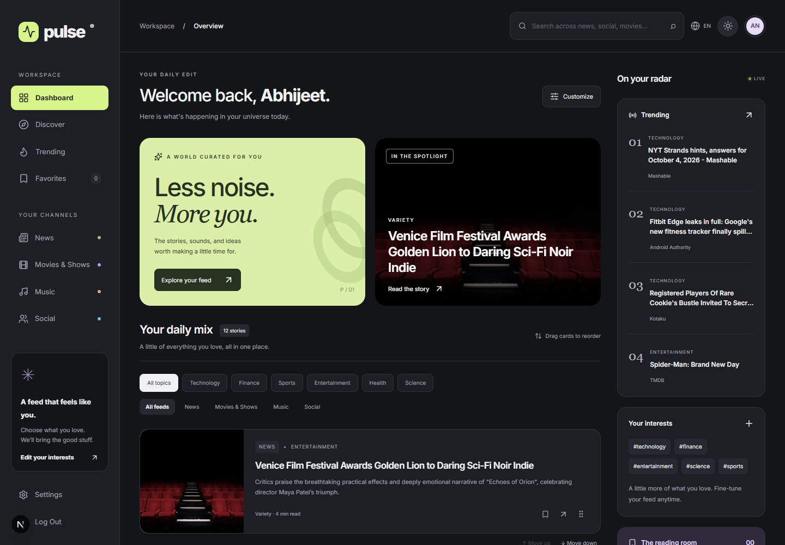

# Pulse — Personalized Content Dashboard

A responsive content workspace built with Next.js 16, React 19, TypeScript, Redux Toolkit, Framer Motion, Tailwind CSS, and react-i18next. News, cinema, music and social posts share one searchable, reorderable feed.

## Run locally

Requires Node.js 22 or newer and npm.

```sh
npm install
cp .env.example .env.local
npm run dev
```

On Windows use `Copy-Item .env.example .env.local`. Open http://localhost:3000. Do not overwrite an existing `.env.local`; it may contain your own keys.

The app works without provider credentials, using curated fallback content. Configure `NEWS_API_KEY` and `TMDB_API_KEY` to enable their live data. Mastodon uses a public hashtag endpoint. Spotify OAuth is available through the existing server integration and requires its client credentials and callback configuration; music recommendations have a curated fallback. Secrets stay in server modules and never use a `NEXT_PUBLIC_` prefix.

## Assignment coverage

| Requirement       | Implementation                                                                                                          |
| ----------------- | ----------------------------------------------------------------------------------------------------------------------- |
| Preferences       | Settings panel with categories, theme, language, compact mode and live updates; browser persistence                     |
| Multiple APIs     | Server-side NewsAPI, TMDB, Mastodon and music services; timeouts and per-source fallback                                |
| Personalized feed | Category and format preferences filter a deduplicated, normalized feed                                                  |
| Content cards     | Images with graceful fallbacks, summaries, details, source links, bookmarks; audio preview when a provider supplies one |
| Pagination        | Server pagination plus intersection-observer loading and a manual load-more button                                      |
| Responsive layout | Desktop sidebar and radar column, compact tablet layout, mobile navigation                                              |
| Trending          | Provider trend flags, global and preference-based views                                                                 |
| Favorites         | Persisted full content records with search and removal                                                                  |
| Search            | 300 ms debounce; server search across the source pool; search also filters trends and favorites                         |
| Drag and drop     | Framer Motion reorder with spring motion, lift and tilt; keyboard move buttons and reset; saved order                   |
| Dark mode         | Light, dark and operating-system theme, CSS custom properties and Tailwind dark variants                                |
| Animation         | Spring drag motion, hover effects and transitions; respects reduced-motion preference                                   |
| State             | Redux Toolkit slices and async thunks; stale feed responses are ignored                                                 |
| Testing           | Vitest + React Testing Library unit/integration tests; Playwright browser workflows                                     |
| Mock auth (bonus) | Local demo signup/sign-in/sign-out and editable profile; no passwords stored or transmitted                             |
| Real-time (bonus) | Server-Sent Events stream with simulated updates, buffered into a new-items button                                      |
| Languages (bonus) | English/Hindi through react-i18next, persisted across reloads                                                           |

## Try the app

1. Open the dashboard. Select a topic or content format; type in the search field.
2. Open a story, follow its official source, or bookmark it. Visit Favorites to see saved items.
3. Drag a card by its grip. It lifts and tilts, and neighboring cards move into place. The move-up/down controls provide a keyboard alternative. Refresh to confirm the order persists.
4. Open Customize. Change interests or compact mode. Toggle light/dark mode and switch to Hindi in the header.
5. Visit `/login`, create a demo account, and edit its name and bio from the avatar menu.
6. Wait for the live update notification and apply the buffered items. Disable live updates in Settings to pause the stream.

## Architecture

- `src/app/api`: same-origin route handlers; feed validation/pagination and SSE.
- `src/server/services`: provider requests, normalization and fallback data. Independent sources load concurrently.
- `src/features`: Redux slices and focused feature components (feed, auth, preferences, favorites, search, realtime).
- `src/components/dashboard`: the introduction and radar sidebar.
- `src/components/cards`: the shared content card.
- `src/store`: store configuration and validated local-storage persistence.

One feed component serves the dashboard and Discover. Provider content uses a shared `ContentItem` union. Cards dispatch simple state actions; server modules own API credentials. There is no separate Express backend.

## Checks

```sh
npm run typecheck
npm run lint
npm test
npm run test:e2e
npm run build
npm start
```

The Playwright configuration uses installed Microsoft Edge. To use bundled Chromium instead, remove `channel: 'msedge'` from `playwright.config.ts` and run `npx playwright install chromium`. Tests start the dev server automatically when one is not already running.

Browser tests intercept provider responses for repeatability and exercise search, empty/error states, pagination, mouse drag, persisted ordering/favorites/theme/language, signup/profile editing, and mobile layout. Integration tests cover fetched rendering, provider errors, empty results, stale requests, preference parameters and malformed browser storage. Actual provider availability is checked separately during local smoke testing.

## Honest demo boundaries

- Authentication is intentionally a **local mock**, permitted by the assignment. It does not establish a secure server identity or protect private data. Use a real identity provider before adding private multi-user data.
- SSE updates are simulated from sample news/social items; the dashboard identifies this. They are not claimed to be breaking news. The connection reconnects automatically and closes when disabled/unmounted.
- Live providers can fail or return no data. The app remains usable with sample content, labeled in the radar note. Samples are not claimed to be current events.
- Music preview availability depends on the provider; full playback stays with the external service. Source links are opened in a separate tab.
- Preferences, favorites, card order and mock profile are local to this browser. Private notes in the detail dialog last for the current app session.
- English/Hindi switching translates primary navigation and dashboard UI; provider titles/descriptions retain their original language.

## Deployment and submission

Deploy this as a Node-compatible Next.js application (for example Vercel), not a static export: route handlers and the SSE endpoint need a server. Add provider keys and a unique `NEXTAUTH_SECRET` through the host's secret settings; set `NEXTAUTH_URL` to the deployment URL. Serverless hosts may periodically end SSE requests; the browser reconnects automatically.

Repository: https://github.com/abhi06032005/PGAAGI_assignement. A hosting project must still be configured for a public live URL. Never commit `.env.local`, generated reports, dependencies, or unrelated installers. The accompanying `docs/WALKTHROUGH.md` provides the reviewer demonstration script.

## Preview and demo



[Watch the recorded walkthrough](docs/pulse-walkthrough.webm) · [Reviewer script](docs/WALKTHROUGH.md)
